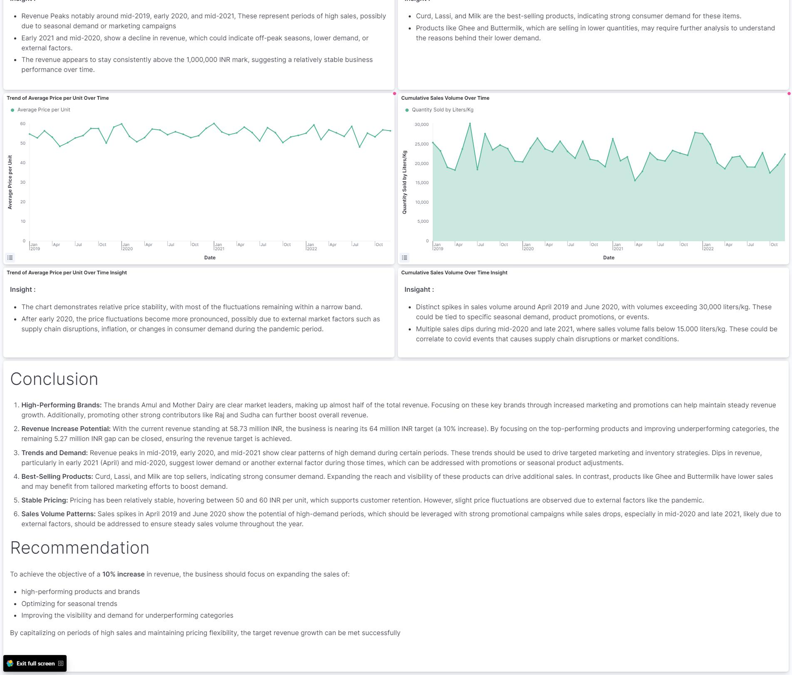

# Dairy Goods Sales Analysis

## Table of Contents
1. [Project Overview](#project-overview)
2. [Project Structure](#project-structure)
3. [Installation and Setup](#installation-and-setup)
4. [Data](#data)
5. [ETL Process and DAG Workflow](#etl-process-and-dag-workflow)
6. [Analysis and Insights](#analysis-and-insights)
7. [Results](#results)
8. [Conclusion](#conclusion)
9. [Future Work](#future-work)
10. [References](#references)
11. [Dashboard](#dashboard)

---

### 1. Project Overview
This project analyzes dairy goods sales data to identify patterns and trends, providing insights that help drive business decisions. The analysis includes data cleaning, exploratory data analysis (EDA), and creating visualizations to better understand sales performance over time. Additionally, the project implements an ETL process using DAGs and data validation using **Great Expectations**.

---

### 2. Project Structure
```bash
├── images/                         # Contains images for the project (e.g., dashboards)
├── P2M3_Heru_DAG.py                # Python script for DAG and ETL process
├── P2M3_Heru_GX.ipynb              # Jupyter notebook for data exploration and validation using Great Expectations
├── P2M3_Heru_data_clean.csv        # Cleaned dataset
├── P2M3_Heru_data_raw.csv          # Raw dataset
├── README.md                       # Project README file
```

---

### 3. Installation and Setup
1. Clone the repository:
   ```bash
   git clone https://github.com/herurmdn7/Dairy-Goods-Sales-Analysis.git
   ```
2. Ensure Python (version >=3.7) is installed.

---

### 4. Data
- **Source**: Dairy goods sales data.
- **Structure**: The dataset contains information on sales performance, including product categories, sales regions, and time-based sales figures.
- **Data Cleaning**: Raw data was cleaned to remove missing values, duplicate records, and outliers, ensuring a more reliable analysis.

---

### 5. ETL Process and DAG Workflow
The project uses an **ETL (Extract, Transform, Load)** process orchestrated by a **DAG** file to automate the workflow. The steps in the DAG workflow are:

1. **Load CSV into PostgreSQL**:
   - The raw sales data (CSV) is loaded into a PostgreSQL database.
   
2. **Fetch Data from PostgreSQL**:
   - Data is fetched from PostgreSQL for further processing.

3. **Preprocessing**:
   - **Handling Missing Values**: Missing values are addressed using various imputation methods.
   - **Handling Duplicates**: Duplicate records are identified and removed.
   - **Column Renaming**: All column names are converted to lowercase, and spaces are replaced with underscores for consistency.

4. **Upload Data to Elasticsearch**:
   - The cleaned and processed data is uploaded to **Elasticsearch** for indexing and further analysis.

The DAG file that handles this ETL process is located in the repository under `P2M3_Heru_DAG.py`.

---

### 6. Analysis and Insights
The project focuses on:
- Analyzing sales trends over time
- Visualizing sales performance by product category and region
- Identifying key drivers of sales growth and areas of improvement
- Exploring correlations between various features in the dataset

---

### 7. Results
1. **High-Performing Brands**: The brands Amul and Mother Dairy are clear market leaders, making up almost half of the total revenue. Focusing on these key brands through increased marketing and promotions can help maintain steady revenue growth. Additionally, promoting other strong contributors like Raj and Sudha can further boost overall revenue.

2. **Revenue Increase Potential**: With the current revenue standing at 58.73 million INR, the business is nearing its 64 million INR target (a 10% increase). By focusing on the top-performing products and improving underperforming categories, the remaining 5.27 million INR gap can be closed, ensuring the revenue target is achieved.

3. **Trends and Demand**: Revenue peaks in mid-2019, early 2020, and mid-2021 show clear patterns of high demand during certain periods. These trends should be used to drive targeted marketing and inventory strategies. Dips in revenue, particularly in early 2021 (April) and mid-2020, suggest lower demand or another external factor during those times, which can be addressed with promotions or seasonal product adjustments.

4. **Best-Selling Products**: Curd, Lassi, and Milk are top sellers, indicating strong consumer demand. Expanding the reach and visibility of these products can drive additional sales. In contrast, products like Ghee and Buttermilk have lower sales and may benefit from tailored marketing efforts to boost demand.

5. **Stable Pricing**: Pricing has been relatively stable, hovering between 50 and 60 INR per unit, which supports customer retention. However, slight price fluctuations are observed due to external factors like the pandemic.

6. **Sales Volume Patterns**: Sales spikes in April 2019 and June 2020 show the potential of high-demand periods, which should be leveraged with strong promotional campaigns while sales drops, especially in mid-2020 and late 2021, likely due to external factors, should be addressed to ensure steady sales volume throughout the year.


---

### 8. Conclusion
This analysis has provided valuable insights into the sales patterns of dairy goods. By focusing on top-performing regions, categories and brands, future sales strategies can be optimized.

---

### 9. Future Work
1. **Forecasting Sales Trends**: Implement a forecasting model to predict future sales based on historical data. This can help optimize inventory management and prepare for high-demand periods.
  
2. **Customer Segmentation**: Perform customer segmentation to better understand purchasing behaviors and target marketing efforts more effectively.

3. **Expanding Product Lines**: Analyze underperforming products and explore opportunities for introducing new products or enhancing existing ones to capture more market share.

4. **Optimizing Pricing Strategies**: Investigate dynamic pricing strategies that can respond to external factors such as supply chain issues, inflation, or seasonal demand fluctuations.

5. **Automating the ETL Pipeline**: Further automate the ETL process to enable real-time data ingestion and updates in the dashboard for quick decision-making.

6. **Integration with Business Intelligence Tools**: Integrate the data pipeline with business intelligence platforms (such as Power BI or Tableau) for more advanced data visualization and reporting.

---

### 10. References
- Dataset: [Dairy-Goods-Sales-Dataset](https://www.kaggle.com/datasets/suraj520/dairy-goods-sales-dataset)
- Tools: Python, Jupyter, Pandas, Matplotlib, Seaborn

### 11. Dashboard


